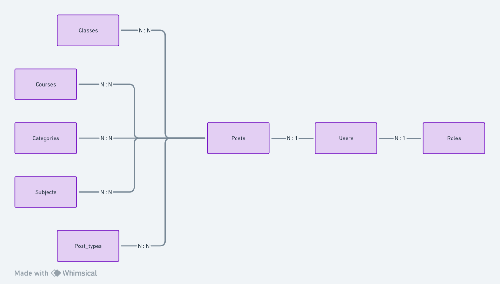
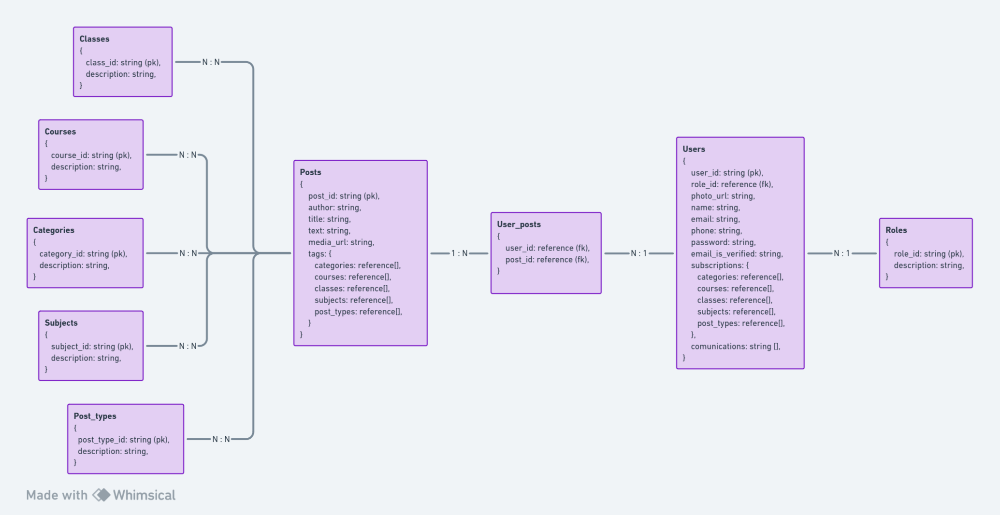

# Portal de Notícias Unificado

## Descrição

Aplicação que tem como função centralizar o canal de comunicação de uma instuição de ensino superior.

## Motivação

Imagine o seguinte caso: em uma instituição de ensino superior existem vários cursos e turmas. Para cada curso existe um coordenador, e para cada turma existe os professores, líderes, vice-líderes e alunos.

Cada turma utiliza grupos de WhatsApp como principal canal de comunicação. No grupo, participa o coordenador do curso e os professores, líderes, vice-líderes e alunos.

No WhatsApp é enviado avisos da coordenção, avisos sobre a instituição, possíveis greves, oportunidades de estágio, eventos da faculdade, etc.

Mas o grande problema é que para cada turma e período existe um grupo de WhatsApp específico que só participam os integrantes daquela turma.

Essa situação limita os alunos de uma turma de participar de projetos e eventos de outras turmas da instituição, simplesmente por não saber da existência daquele evento.

Outra situação é a perda de oportunidades para com as vagas de emprego, uma vez que um aluno de uma turma fica limitado às oportunidades postadas apenas no seu canal de comunicação.

Tendo em vista esses problemas, tive a ideia de criar um <b>Portal de Notícias Unificado</b> para a instituição, que visa a integração das turmas por meio de um canal de comunicação único.

## Objetivos

- Fornecer um canal de comunicação da instituição, unificado, que permita a interação entre cursos e turmas diferentes.
- Fornecer uma alternativa que seja mais conveniente que o uso de grupos de WhatsApp.

## Requisitos Funcionais

### Autenticação

- O sistema deve permitir que os usuários criem uma conta usando um email e senha.
- O sistema deve validar o email para que o cadastro seja efetuado com sucesso.
- O sistema deve permitir que os usuários façam o login usando email e senha verificados.
- O sistema deve permitir a recuperação de senha por email, uma vez que o cadastro seja efetuado.

### Publicações

- O sistema deve exigir cargos de admin, coordenador, líder, vice-líder ou professor para fazer uma postagem em uma categoria.
- O sistema deve permitir a criação de posts com texto e foto ou texto e vídeo.
- O sistema deve permitir os usuários que possuam permissão executar as operações basicas de criação, leitura, remoção e edição de posts.
- O sistema deve fornecer categorias de filtragem para facilitar a visualização de postagens por parte do aluno.
- O sistema deve categorizar as postagens, definindo o tipo de postagem, a área, o curso, a turma e a matéria.
- O sistema deve permitir que o usuário faça uma inscrição para aquela determinada categoria.

### Comunicação

- O sistema deve dar a opção do usuário habilitar as formas de comunicação: e-mail e/ou WhatsApp.
- O sistema deve notificar o usuário por e-mail sobre um novo post na categoria se o mesmo inscreveu-se e habilitou comunicação por e-mail.
- O sistema deve notificar o usuário por mensagem no WhatsApp sobre um novo post na categoria se o mesmo inscreveu-se e habilitou comunicação por WhatsApp.

### Administração

- O sistema deve ter uma área reservada para usuários com cargos de Admin.
- O sistema deve permitir que o admin veja os usuários cadastrados.
- O sistema deve permitir que o admin crie ou remova usuários.
- O sistema deve permitir que o admin modifique os cargos dos usuários cadastrados.
- O sistema deve permitir que admins façam a adição, modificação e remoção de categorias.
- O sistema deve permitir que admins façam a adição, modificação e remoção de postagens.

## Requisitos Não Funcionais

- Os dados do usuário como senha e número de telefone devem ser armazenados de forma criptografada, para conservar a privacidade dos usuários.
- A autenticação deve usar Cookies para proteger a aplicação de ataques XSS.
- O banco deve ser NoSQL para suportar eventuais mudanças da estruturação dos dados, além de melhorar na perfomance das filtragens.
- A interface deve ser intuitiva e fácil de usar.
- A interface deve ser responsiva e se adequar para desktops, tablets e celulares.

## Diagrama Entidade-Relacionamento (DER)

## Modelagem do banco (MongoDB)

